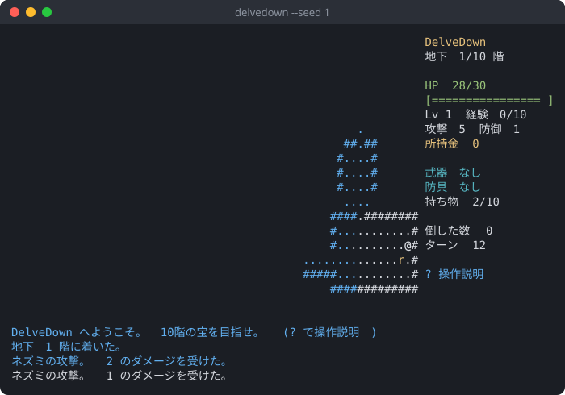

# DelveDown

ターミナルで遊ぶ、文字で描くダンジョンのローグライクです。curses で動くので SSH 越しにも遊べます。
1回のプレイは15〜30分ほど。地下10階のボスを倒して宝を手に入れればクリアです。

- 階は毎回自動で作られます(部屋と通路)。`--seed` を付けると同じダンジョンを再現できます。
- 視界はシャドウキャスティング。一度見た場所は暗い色で覚えておきます。
- 敵は7種類とボス。見えたら追ってきて、見えないときはうろつきます。
  コウモリはふらふら動き、オーガは2手に1回しか動かず、トロルは傷が治っていきます。
- 回復薬・巻物(テレポート、地図)・武器・防具・お金。足元の物は自動で拾います(10個まで)。
- 死ぬかクリアすると結果画面。ハイスコア上位10件を保存します。
- 音は鳴らしません。

## 画面

`delvedown --seed 1` で何手か動いたところ(80x24 の端末):



右がステータス、下が最新のメッセージです。`@` が自分、小文字・大文字が敵、`>` が下り階段です。

## 動作環境

- Linux(Arch Linux で確認)。curses が使える端末なら、SSH 越しでも遊べます。
- Python 3.11 以上。標準ライブラリだけで動き、依存はありません。
- 端末は 80x24 以上。小さいときは「端末を広げてください」と出して待ちます。色の無い端末でも遊べます。

## 入れ方

pipx で入れる:

```sh
pipx install git+https://github.com/takosasi-dev/delve-down
delvedown
```

clone して動かす:

```sh
git clone https://github.com/takosasi-dev/delve-down
cd delve-down
python3 -m delvedown
```

## 使い方

```sh
delvedown                 # 遊ぶ(シードはおまかせ。結果画面に出る)
delvedown --seed 1        # シード 1 のダンジョンで遊ぶ
delvedown --scores        # ハイスコアを表で出す
delvedown --scores --json # ハイスコアを JSON で出す
delvedown --seed 1 --autoplay 3000   # 画面なしで自動操作役に 3000 手遊ばせ、結果を JSON で出す
```

### 操作

| キー | 動作 |
|---|---|
| 矢印キー / `h` `j` `k` `l` / テンキー | 移動。敵に向かって動くと攻撃 |
| `y` `u` `b` `n` / テンキー `7` `9` `1` `3` | 斜めに移動 |
| `.` / テンキー `5` | その場で待つ |
| `>` | 階段を降りる |
| `i` | 持ち物。文字キーで使う・装備する・外す |
| `d` | 持ち物を置く。文字キーで選ぶ |
| `?` | 操作説明 |
| `Q` | 終了(確認あり。スコアは残らない) |

### ハイスコアの置き場所

`$XDG_DATA_HOME/delvedown/scores.json`。`XDG_DATA_HOME` が無ければ `~/.local/share/delvedown/scores.json`。
`--scores-file` で場所を変えられます。ファイルが壊れているときは上書きせず、結果画面で「保存できませんでした」と出します。

## 開発

```sh
python3 tests/run_all.py
```

ゲームの中身(マップ生成・視界・戦闘・敵の動き・アイテム)は curses を使わない純粋なコードで、テストはそこに当てています。
Linux では疑似端末で本物の画面も動かして確かめます。乱数は1本の `random.Random(seed)` から取るので、同じシードと同じ入力なら同じ結果になります。

## ライセンス

MIT

## 開発状況

v0.1.0。数値の調整はまだ仮です。
